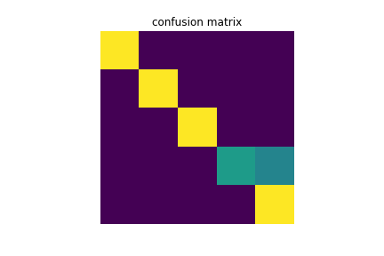
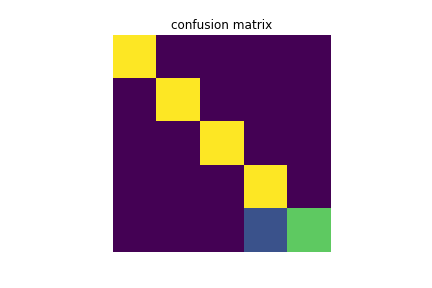

# HandGesture

## Introduction

This project was conducted to develop a program that classifies hand gestures from images received in real time. Because online classes have become commonplace due to COVID19, excessive video traffic on platforms such as Zoom have increased. To help mitigate traffic, this program was created so one may use hand gestures to communicate. Instead of keeping the camera on all the time, this program allows people to communicate using certain hand gestures.

The hand gestures are named: **one, two, three, thumb up, thumb down, hand raise**. **one** represents holding the index finger up; **two** holding the index and middle; **three** index, middle, and ring; **thumb up and down** represents a thumbs up or down; and **hand raise** represents a fist.

Jupyter Notebook [[1]](#References) was used to plan and fine tune code but the final programs were written in Python. Matplotlib [[2]](#References) and clear_output from IPython [[3]](#References) was used to visualize and test the program but were not used in the python files. To obtain video from the camera, cv2 [[4]](#References) was used. Then, MediaPipe [[5]](#References) was used to map out certain points (called landmarks) on a hand and get 3D coordinates for these points. 

The first method, called the simple method, determined hand gestures by looking at the y-coordinate (which is vertical) of certain landmarks. For example, for the program to recognize a hand as **one**, the landmarks on the index finger had to be above the other landmarks.

But the simple method was not totally accurate: a tilted hand holding up the index finger would not be registered as **one**. To solve this problem, a second method was created, dubbed the complex method. The complex method used the angles between each joint to classify the hand gesture. Two points make a line and two lines make an angle. Using vector functions and the numpy library [[6]](#References), the angle between each joint could be found (3 per finger for a total of 15 angles). By devising a jupyter program, data was stored using pickle [[7]](#References). The coordinates of the landmarks and the respective hand gesture were recorded for each instance. For each hand gesture, 80 instances were collected. Then, the K-Nearest Neighbor classifier [[8]](#References) used the data to create a program that can predict the hand gesture based on angles.

---

## Requirements

- python3
- mediapipe
- sklearn
- matplotlib
- cv2 (`pip install opencv-python`)
- jupyter
- numpy
- IPython.display
- pickle

---

## How to Run

### Simple Method

`python simple_method.py`

### Complex Method

`python complex_method.py`

---

## Results

20 instances were recorded per hand gesture (**thumb up**/**thumb down** were grouped). The results are showm below.

### Accuracy

- simple method: 91.0%
- complex method: 95.0%

### Confusion Matrix

- simple method:
  - 

|class 1|class 2|class 3|class 4|class 5|
|-------|-------|-------|-------|-------|
|20     |0      |0      |0      |0      |
|0      |20     |0      |0      |0      |
|0      |0      |20     |0      |0      |
|0      |0      |0      |11     |9      |
|0      |0      |0      |0      |20     |

- complex method:
  - 

|class 1|class 2|class 3|class 4|class 5|
|-------|-------|-------|-------|-------|
|20     |0      |0      |0      |0      |
|0      |20     |0      |0      |0      |
|0      |0      |20     |0      |0      |
|0      |0      |0      |20     |0      |
|0      |0      |0      |5      |15     |

---

## Conclusion

As expected, the complex method turned out to be more accurate than the simple method. However, to further improve the complex method, more data can be used for training. This will help valitdate gestures and lessen the effect of outliers. Also, the RadiusNeighbor classifier may be more accurate than the KNearestNeighbor algorithm.

---

## References

[1] [Jupyter Notebook](https://jupyter.org/)

[2] [Matplotlib](https://matplotlib.org/)

[3] [IPython.display](https://ipython.readthedocs.io/en/stable/api/generated/IPython.display.html)

[4] [OpenCV](https://opencv.org/)

[5] [MediaPipe](https://google.github.io/mediapipe/)

[6] [NumPy](https://numpy.org/)

[7] [Pickle](https://docs.python.org/3/library/pickle.html)

[8] [SKLearn](https://scikit-learn.org/stable/modules/neighbors.html)